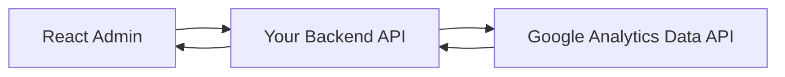

# GA4 실제 데이터 연동 가이드

현재 프론트엔드는 Mock 데이터로 구현되어 있습니다. 실제 GA4 Data API(V1)를 연동하기 위한 단계별 절차를 안내합니다.

## 1. 아키텍처 개요

프론트엔드에서 직접 구글 API를 호출하는 것은 보안상 위험(API 키 노출)하므로, **백엔드 프록시(Backend Proxy)** 구조를 권장합니다.



## 2. 구글 클라우드 & GA4 설정

1. **Google Cloud Project 생성**: [Google Cloud Console](https://console.cloud.google.com/)에서 새 프로젝트를 생성합니다.
2. **API 활성화**: `Google Analytics Data API`를 검색하여 활성화(Enable)합니다.
3. **서비스 계정(Service Account) 생성**:
    - '사용자 인증 정보' 메뉴에서 서비스 계정을 생성합니다.
    - 생성된 계정의 **키(JSON)**를 다운로드합니다. 이 파일에 담긴 정보(`client_email`, `private_key`)가 백엔드 서버에 필요합니다.
4. **GA4 속성 권한 부여**:
    - 서비스 계정의 이메일 주소를 복사합니다.
    - GA4 관리 메뉴 -> 속성 설정 -> 속성 액세스 관리에서 해당 이메일을 **'조회자(Viewer)'** 이상의 권한으로 추가합니다.

## 3. 백엔드 구현 예시 (Node.js)

백엔드 서버에 `@google-analytics/data` 라이브러리를 설치하고 아래와 같이 구현합니다.

```javascript
// npm install @google-analytics/data
const { BetaAnalyticsDataClient } = require('@google-analytics/data');

const analyticsClient = new BetaAnalyticsDataClient({
  credentials: {
    client_email: process.env.GA_CLIENT_EMAIL,
    private_key: process.env.GA_PRIVATE_KEY.replace(/\\n/g, '\n'),
  },
});

async function getDAU(propertyId) {
  const [response] = await analyticsClient.runReport({
    property: `properties/${propertyId}`,
    dateRanges: [{ startDate: '7daysAgo', endDate: 'today' }],
    metrics: [{ name: 'activeUsers' }],
    dimensions: [{ name: 'date' }],
  });
  return response;
}
```

## 4. 프론트엔드 코드 수정

`src/api/analytics.ts` 파일의 Mock 함수를 백엔드 API 호출로 변경합니다.

```typescript
// src/api/analytics.ts 수정 예시
import axios from 'axios';

export const getGeneralKPI = async (period: string) => {
  // 실제 백엔드 엔드포인트 호출
  const response = await axios.get(`/api/analytics/general?period=${period}`);
  return response.data; 
};
```

## 5. 주의사항
- **Property ID**: GA4 설정 화면에서 확인 가능한 숫자 형태의 ID(Property ID)가 필수입니다.
- **Quota 관리**: Data API는 하루 호출 제한(Quota)이 있으므로, 백엔드에서 **캐싱(Redis 등)**을 적용하는 것이 좋습니다.
- **환경 변수**: `private_key`와 같은 민감 정보는 반드시 서버의 `.env` 파일로 관리하세요.
